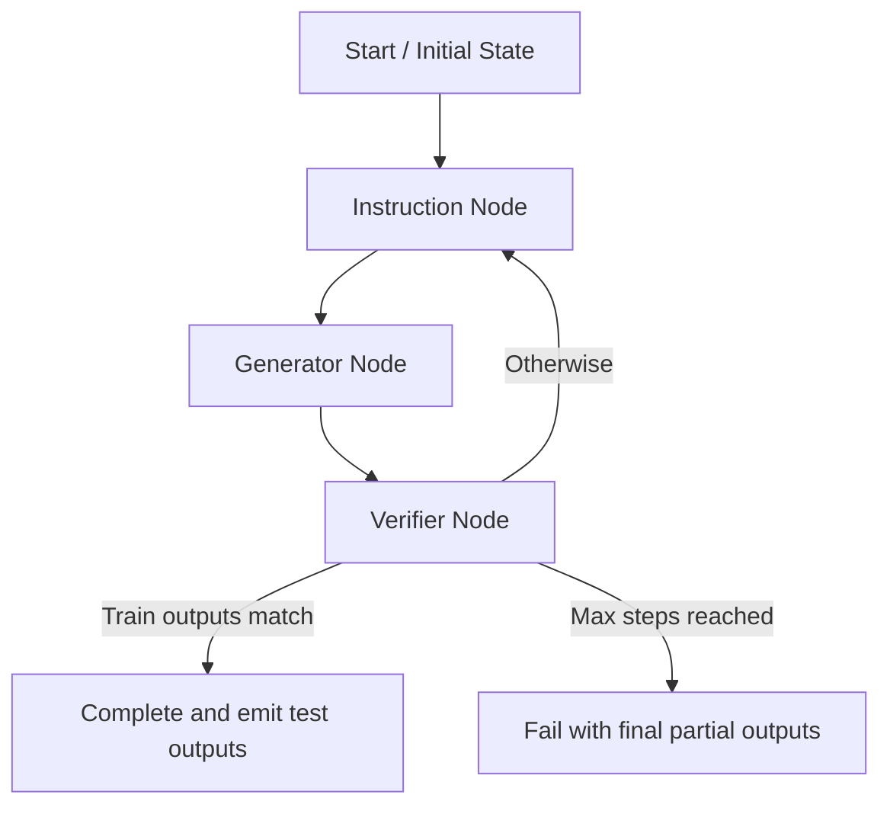

# LangGraph ARC Solver Plan

## 1. Project Structure Overview

- [`langgraph_solver_plan.md`](langgraph_solver_plan.md) – architecture and planning document.
- [`representation_utils.py`](representation_utils.py) – existing utilities for textual and image grid representations.
- [`state.py`](state.py) – shared dataclasses and helper functions for solver state, configuration, and token accounting.
- [`agents.py`](agents.py) – Instruction and Generator LLM wrappers, including prompt templates and structured response handling.
- [`graph.py`](graph.py) – LangGraph graph definition with Instruction, Generator, and Verifier nodes, plus loop control.
- [`runner.py`](runner.py) – entry point to orchestrate task loading, execution across tasks, logging, and output artifact generation.
- [`logging_utils.py`](logging_utils.py) – file logger creation, print wrapper, and standardized log formatting.
- [`outputs/`](outputs/) – directory for logs and generated artifacts (combined grid images, submission files, etc.).

## 2. Shared State Design (`state.py`)

### 2.1 Data Classes
- `SolverConfig`
  - Fields: `task_file`, `task_ids`, `num_of_tasks`, `offset_tasks`, `reasoning_level`, `max_steps`, `use_images`.
  - Provides derived helpers (e.g., `should_use_images()`).

- `SampleGrids`
  - Fields: `train_inputs`, `train_outputs`, `test_inputs`.
  - Methods to convert to textual and base64 image representations via [`representation_utils.grid_to_text`](representation_utils.py:32) and [`representation_utils.grid_to_base64_png`](representation_utils.py:180).

- `SolverState`
  - Core fields:
    - `config: SolverConfig`
    - `task_id: str`
    - `step_index: int`
    - `instructions: list[str]`
    - `train_partial_outputs: list[list[GRID]]` (aligned with train samples)
    - `test_partial_outputs: list[list[GRID]]`
    - `generator_status: str | None`
    - `token_usage: TokenUsage`
    - `graph_status: str` (e.g., `"running"`, `"completed"`, `"failed"`)
    - `last_verifier_passed: bool`
  - Methods:
    - `advance_step(new_instruction, new_outputs, status, usage_delta)` returns new state.
    - `is_complete()` – true when train outputs match ground truth or `step_index >= max_steps`.
    - `clone_with_updates(...)` for immutable-ish updates.

- `TokenUsage`
  - Fields: `input_tokens`, `cached_tokens`, `output_tokens`, `total_tokens`.
  - Method `add(usage_dict)` to accumulate values.
  - Method `cost()` implementing GPT-5 pricing:
    ```
    cost = ((input_tokens - cached_tokens) * 2.5 +
            cached_tokens * 0.25 +
            output_tokens * 20) / 1_000_000
    ```

### 2.2 Helper Functions
- `create_initial_state(config, task_id, samples)` – initializes default state with empty instructions and partial outputs matching sample counts.
- `update_partial_outputs(existing, new_outputs)` – ensures unchanged outputs are preserved unless overwritten by generator (per requirements).
- `build_user_content_samples(samples, include_outputs, diff_fn)` – shared utility for LLM inputs that prepares text/image pairs.

## 3. Logging Strategy (`logging_utils.py`)

- On run start, generate `run_id = datetime.utcnow().strftime("%Y%m%d-%H%M%S") + "-" + short_uuid`.
- Log file path: `outputs/run_{run_id}.log`.
- `setup_logger(run_id)` returns tuple `(logger, log_path)`, ensures directory exists, configures `logging.Logger` with `FileHandler` (append mode) and `StreamHandler` for console.
- `LogPrint.log(message)` prints to console and logs to file.

## 4. Instruction Agent Plan (`agents.py`)

### 4.1 Prompt Template
- System message: “You are a strategic ARC instruction planner producing minimal incremental instructions…”
- Include bullet points reminding agent:
  - Generate exactly one instruction step.
  - Reference current instructions, generator status, diffs.
  - Avoid performing actions; describe instruction for generator only.
  - Allow revisions if previous step should be corrected.
  - Stop when puzzle solved or no further actions.
- User payload construction:
  - `Context:` textual description summarizing step index, reasoning level, generator status.
  - `Instructions so far:` enumerated list.
  - `Train Samples:` for each sample, include text representation and optionally base64 input/output diff when available.
  - `Test Samples:` inputs only.
  - `Partial Outputs:` include textual representation plus base64 images; repeat existing outputs if unchanged.
  - `Diff Summaries:` when train partial outputs exist, include text diffs via [`representation_utils.generate_grid_diff`](representation_utils.py:117).
- Structured response schema (JSON via `response_format`):
  ```
  {
    "instruction": "string",
    "rationale": "string",
    "confidence": "low|medium|high"
  }
  ```
- Token accounting: after `client.responses.create`, call `token_usage.add(resp.usage.to_dict())`.
- Reasoning effort: based on config, map to API `reasoning` argument.

### 4.2 Error Handling
- On empty instruction or API failure, log and retry (limited times) or mark state as failed.

## 5. Generator Agent Plan (`agents.py`)

### 5.1 Prompt Template
- System message: “You transform ARC grids according to instructions… respond with structured status and updated outputs…”
- Emphasize:
  - Apply new instruction against current partial outputs.
  - Re-emit existing outputs if no change.
  - Provide concise status summary referencing grid changes.
  - Use structured outputs (text + base64) for each train/test sample.
- User payload:
  - `New Instruction`
  - `Instruction History` (to ensure full context)
  - `Train/Test Inputs`
  - `Current Partial Outputs`
- Structured response schema:
  ```
  {
    "status": "string",
    "train_outputs": [
      {
        "grid": [[...]],
        "grid_text": "string",
        "grid_image_b64": "string"
      },
      ...
    ],
    "test_outputs": [
      {
        "grid": [[...]],
        "grid_text": "string",
        "grid_image_b64": "string"
      },
      ...
    ]
  }
  ```
- Always include `grid_text` derived from [`grid_to_text`](representation_utils.py:32) and base64 via [`grid_to_base64_png`](representation_utils.py:180).
- For unchanged outputs, ensure previous grid is repeated verbatim (state helper handles merges).
- Append token usage identical to instruction agent.

## 6. Verifier Node Plan (`graph.py`)

### 6.1 Responsibilities
- Compare each train partial output against expected outputs present in samples.
- Use direct list comparison; when mismatch, generate diff summary for logging (via [`generate_grid_diff`](representation_utils.py:117)).
- Update state:
  - `last_verifier_passed` boolean.
  - If all match → set `graph_status = "completed"`.
  - Else increment `step_index`. If `step_index >= max_steps`, set `graph_status = "failed_max_steps"`.
- Provide transitions back to Instruction node when not complete.

### 6.2 LangGraph Implementation
- Create graph with typed state; nodes:
  - `instruction_node(state) -> state`
  - `generator_node(state) -> state`
  - `verifier_node(state) -> state`
- Condition at end of verifier:
  - If `state.graph_status == "completed"` → exit.
  - If `state.step_index >= config.max_steps` → exit failure.
  - Else route to instruction node.

### 6.3 Mermaid Overview


## 7. Runner Orchestration (`runner.py`)

### 7.1 Task Loading
- Load JSON via `json.load(open(config.task_file))`.
- Determine solutions path by replacing `"challenges"` with `"solutions"`; load if exists.
- Determine task list:
  - If `task_ids` provided → iterate in order given.
  - Else apply `offset_tasks` and `num_of_tasks` to key-sorted task IDs.

### 7.2 Execution Loop
- For each task:
  - Construct `SampleGrids`.
  - Create initial state and graph.
  - Run LangGraph (synchronous) capturing final state.
  - Log instructions per step and generator statuses.
  - Track aggregate stats: solved count, failed count.

### 7.3 Output Handling
- Combined image creation:
  - Use `representation_utils.grid_to_base64_png` to produce PNGs.
  - Compose final collage (optional) or save individual PNG files for train/test inputs, expected outputs, predicted outputs (per step or final).
  - Convert base64 to file by `base64.b64decode` and writing to `outputs/{run_id}_{task_id}_train_pred.png`, etc.
- Logging:
  - Include step-by-step instruction list, generator status summary, token usage per node, final cost.

### 7.4 Solutions vs Submission
- If solutions file available:
  - Compare final test outputs to solutions.
  - Increment correct/incorrect counters.
  - Log summary per task and cumulative totals.
- Else:
  - Build submission structure:
    ```
    submissions[task_id] = [
        {"attempt_1": grid_a, "attempt_2": grid_a}  # per test sample
    ]
    ```
  - Write JSON to `outputs/submission_{run_id}.json`.

### 7.5 Final Reporting
- After all tasks:
  - Print/log overall stats (tasks run, solved, failed, cost).
  - Display final instructions for last task & verification outcome.

## 8. Next Steps

1. Review plan and adjust as needed.
2. Upon approval, switch to Code mode to implement modules in the repository root.